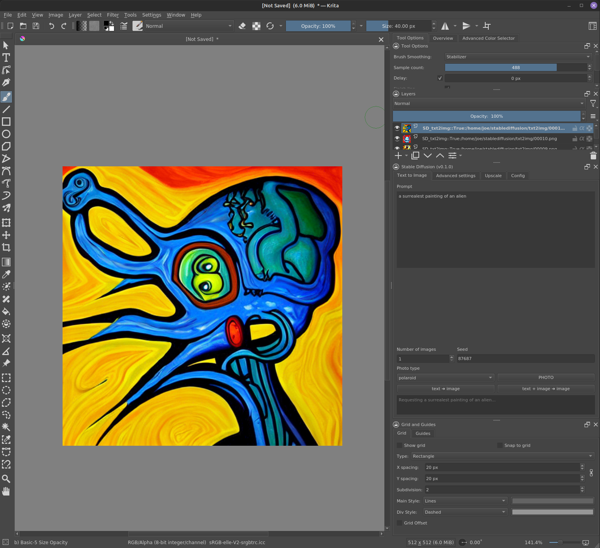
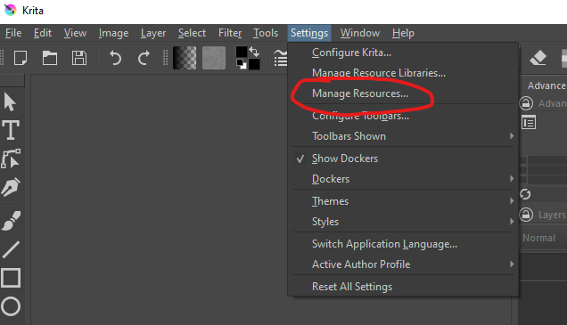
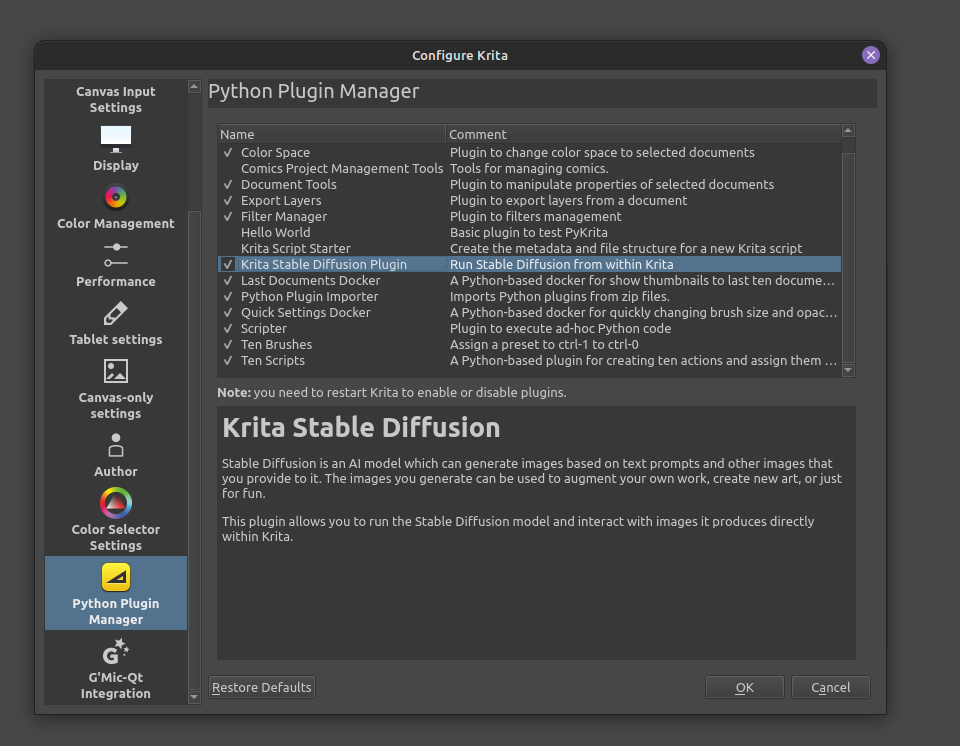
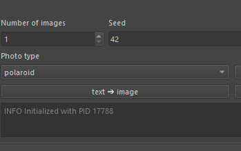
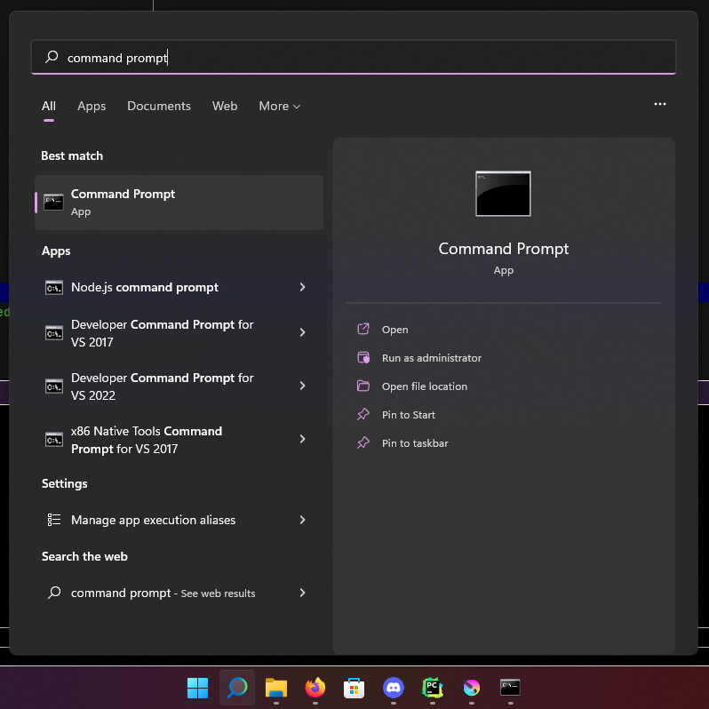
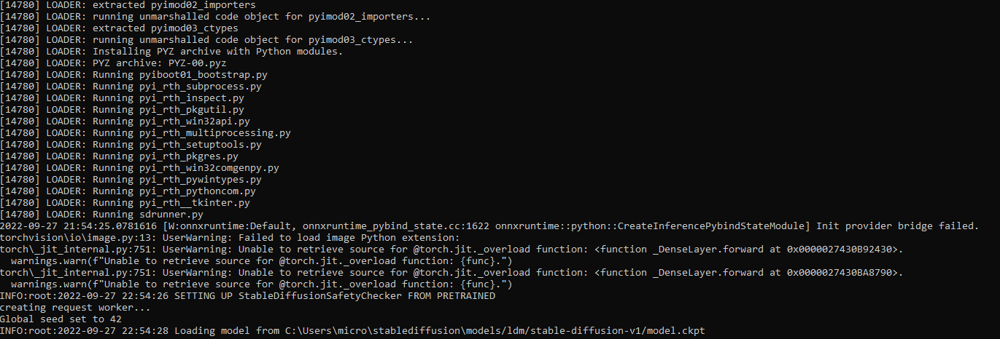
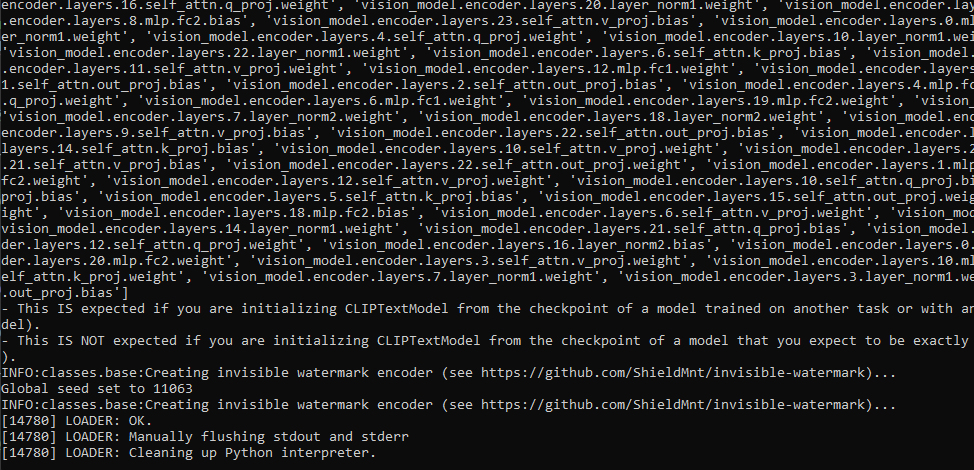

# Krita Stable Diffusion

[](https://github.com/w4ffl35/krita_stable_diffusion/releases/download/0.3.1-alpha-win/krita-stable-diffusion-windows-0.3.1-alpha.7z)
[](https://github.com/w4ffl35/krita_stable_diffusion/releases/download/0.2.2-alpha/krita-stable-diffusion_multifile-0.2.2.tar.xz)
[](https://discord.com/channels/839511291466219541/1022298294338191381)


---



- Runs on Windows 11 and Ubuntu 20.04
- Run Stable Diffusion locally in Krita without the need for a Python environment.
- **Easy installation: no need to install Python, no need to install dependencies (**cuda 11.3 drivers may be required**)**
- Non-blocking image generation: continue working in Krita while your images generate
- No need for webui or a webserver at all
- Ability to enqueue multiple requests, allowing you to generate multiple prompts and come back to see them after
- NSFW toggle

---

## Getting started

### Download Krita

Download and install the latest version of Krita from [krita.org](https://krita.org/en/download/krita-desktop/)


### Download the Stable Diffusion plugin

### [Windows](#windows)

The Windows installer will download the model, but you need a [Huggingface.co](https://huggingface.co/join) account to do so.

When you run the installer script, you will be asked to enter your hugging face credentials. 
It is recommended that you first sign up for a hugging face account, then following the remaining steps if you would like to download the model using the installer.

Otherwise, you can download the model and set it up manually.

[](https://github.com/w4ffl35/krita_stable_diffusion/releases/download/0.3.0-alpha-win/krita-stable-diffusion-windows-0.3.0-alpha.7z)

1. [Download the latest release](https://github.com/w4ffl35/krita_stable_diffusion/releases/download/0.3.1-alpha-win/krita-stable-diffusion-windows-0.3.1-alpha.7z)
2. Unzip it ``
3. Double click `install.bat`
4. Follow the prompts
5. Enable the plugin (see below for more info)
6. [Run the server](#run-the-server)

#### Troubleshooting

If you run into issues with the installation script, you can try a manual installation.

1. Download the relase
2. Unzip it
3. Open Krita, go to `Settings > Manage Resources... >`



4. Click the `Open Resources Folder` button


5. Inside of the Resources folder, open the `pykrita` folder1
6. Copy everything inside of your downloaded `pykrita` folder into the resources `pykrita` folder

**From:** `krita-stable-diffusion-windows-0.3.0\0.3.0\multifile\pykrita\<EVERYTHING IN HERE>` 

**To:** `%AppData%\krita\pykrita` (default location)

7. Copy the stablediffusion folder `krita-stable-diffusion-windows-0.3.0\0.3.0\stablediffusion\` into your home folder
8. Enable the plugin

### Linux

[](https://github.com/w4ffl35/krita_stable_diffusion/releases/download/0.2.2-alpha/krita-stable-diffusion_multifile-0.2.2.tar.xz)


1. [Download the latest release](https://github.com/w4ffl35/krita_stable_diffusion/releases/download/0.2.2-alpha/krita-stable-diffusion_multifile-0.2.2.tar.xz)
2. Unzip it `tar -xf krita-stable-diffusion_multifile-0.2.2.tar.xz`
3. Change into the correct directory `cd plugin_dist/0.2.2/krita-stable-diffusion_multifile-0.2.2`
4. Run install script `./install`
5. Follow the prompts to download the model if you don't have it already (requires hugging face account)

### Enable the plugin

1. Start Krita 
2. Click `Settings > Configure Krita...`
3. In the side bar scroll down to `Python Plugin Manager` and click it
4. In the right panel look for Krita Stable Diffusion Plugin and check the box next to it
5. Click Ok
6. Restart Krita

If you have difficulty finding the model, [look at the FAQ](https://github.com/w4ffl35/krita_stable_diffusion/wiki/FAQ).



---

## Using the plugin

These instructions are for Windows users only.

For now, its necessary to manually run the server and pass it a PID each sesson. 
This is an extra step that will be eliminated soon.

## Run the server

After enabling the plugin and starting Krita you will notice an info panel which
displays a PID



Make note of the PID, you need it to run the server, and you need the server 
in order to generate images.

**Open a command prompt**



**Change into the pykrita resources folder**

Assuming default location:

```
cd %AppData%\krita\pykrita\krita_stable_diffusion\stablediffusion\sdrunner --pid <YOUR PID HERE>
```

**press enter** and you will see the server starting up.



Once you see this, you know it is ready: 



Now switch back to krita and start generating images.

---

## Uninstall (linux only)

1. `./plugin_dist/0.2.2/krita-stable-diffusion_multifile-0.2.2/uninstall`
2. Follow the prompts

---

## Cuda Drivers

[MAY REQUIRE CUDA 11.3 DRIVERS](https://developer.nvidia.com/cuda-11.3.0-download-archive?target_os=Linux&target_arch=x86_64&Distribution=Ubuntu&target_version=20.04&target_type=runfile_local)

First try the plugin without installing Cuda drivers. 

If you see errors, install Cuda 11.3 drivers and see if this resolves your issues.

Do not use a different version of CUDA, only 11.3.

### Windows

1. [Download Cuda Toolkit 11.3](https://developer.download.nvidia.com/compute/cuda/11.3.0/local_installers/cuda_11.3.0_465.89_win10.exe)
2. Install it

### Linux

If you are on Ubuntu 20.04, use the runfile.

```
wget https://developer.download.nvidia.com/compute/cuda/11.3.0/local_installers/cuda_11.3.0_465.19.01_linux.run
sudo sh cuda_11.3.0_465.19.01_linux.run
```


---

### System requirements

This plugin will run on a variety of systems. As it is tested the results will
be listed below.

If you have a different system than the one listed below, [please post your
results in this discussion thread](https://github.com/w4ffl35/krita_stable_diffusion/discussions/16).

| OS |    GPU    |      CPU      | HD Space | RAM | Krita | Cuda Drivers |
|:---:|:---------:|:-------------:|:---------:|:---:|:-----:|:------------:|
| Ubuntu 20.04 | RTX 2080s | Ryzen 7 2700x | 20gb | 32GB | 5.1.1 |    11.3*     |

* Cuda drivers may not be required, but are recommended.

---

Please post your results on
the [discussion board](https://github.com/w4ffl35/krita_stable_diffusion/discussions).
